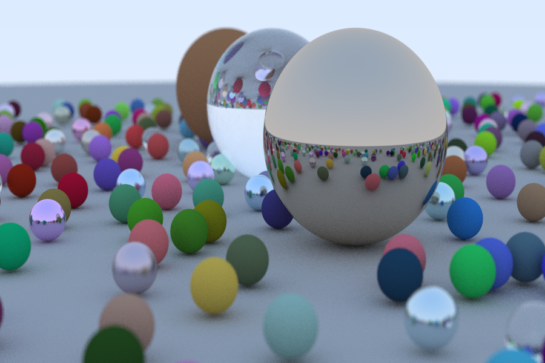

---
# Ray Tracing Playground
This is a repo made for educational purposes, I'm currently following
[Ray Tracing in One Weekend](https://raytracing.github.io/books/RayTracingInOneWeekend.html)
though I'm planning to follow the other boooks in the series, and any other interesting ideas
I see for ray tracing.

# Demo

